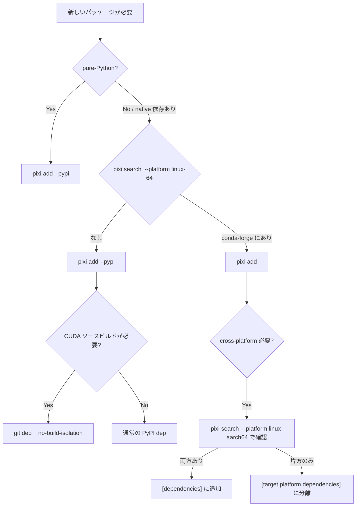

# Pixi 環境構築ルール

> 出典: Notion Pixi Wiki (Advent Calendar 2025) / Pixi FAQ + SyncHuman GH200 対応での実践知見
>
> **Note**: このスキルはプロジェクト単位の `pixi.toml` / `pyproject.toml` による
> 環境構築を扱う。システムワイドなツール管理 (`pixi global` / `pixi-global.toml`)
> については nanokit の CLAUDE.md を参照。

## 基本方針

**pixi でプロジェクトの全依存関係を管理する。** conda-forge と PyPI を使い分け、
pixi.toml / pyproject.toml + pixi.lock で再現可能な環境を実現する。

### conda-forge と PyPI の使い分け原則

- **pure-Python パッケージ**: PyPI (`pixi add --pypi`)
- **非 Python の依存 (C/C++, CUDA, Rust ツール等)**: conda-forge (`pixi add`)
- **低レイヤの依存は混ぜない**: 同じライブラリを conda と PyPI の両方から入れない

理由:
- conda は platform-native バイナリを提供 (ABI 整合性保証)
- PyPI wheel は特定の CUDA/PyTorch ビルドに紐づき、conda 版と混ぜると ABI 不一致で segfault する
- conda-forge は依存ライブラリを共有ライブラリとして管理し、コミュニティで効率よくアップデートする
- PyPI wheel は self-contained (依存を内包) で手軽だが、pip の外側からは使えない

## プロジェクト初期化

| 用途 | コマンド | ファイル |
|---|---|---|
| Python パッケージにする | `pixi init --format pyproject` | `pyproject.toml` (`[tool.pixi.*]`) |
| それ以外 (C++/Rust/ML 実験) | `pixi init` | `pixi.toml` |

### Python バージョン指定

conda パッケージとして project-local にインストール:

```bash
pixi add python==3.11
```

### src layout (デフォルト)

`pixi init --format pyproject` は src-layout を生成。
`demo = { path = ".", editable = true }` により `pixi install` で editable install される。

```
.
├── pyproject.toml
└── src
    └── demo
        └── __init__.py
```

## パッケージ追加の判断フロー



### バージョン確認

```bash
# 追加して solver に聞く (互換性がなければエラーで教えてくれる)
pixi add <pkg>

# platform 別の存在確認
pixi search <pkg> --platform linux-64     # x86_64
pixi search <pkg> --platform linux-aarch64 # ARM
```

### 特殊なインストール方法

`pixi add` で入らない場合、`pyproject.toml` を直接編集 → `pixi install`:

```toml
[tool.pixi.pypi-dependencies]
# extras
sglang = { version = "==0.4.6.post5", extras = ["all"] }
# git (branch, tag, rev 指定可)
httpx = { git = "https://github.com/encode/httpx.git", rev = "c7c13f1" }
# ローカルパス (editable)
my-module = { path = "./my-module", editable = true }
# 直接 URL (.whl / .tar.gz)
click = { url = "https://github.com/pallets/click/releases/download/8.1.7/click-8.1.7-py3-none-any.whl" }
```

## Task / Feature / Environment

### Task の活用

pixi では shell に入るのではなく **task でコマンドを実行するのが基本**:

```toml
[tasks]
train = { cmd = "python train.py", cwd = "scripts" }
test = "python -m pytest tests/ -v"
lint = "ruff check ."
fmt = "ruff format ."
```

```bash
pixi run train          # task を実行
pixi run train --lr=0.1 # 引数を付け足せる
pixi run -e gpu train   # 特定環境で実行
```

### Feature / Environment

feature を組み合わせて目的別の environment を構成する:

```toml
[feature.dev.dependencies]
ruff = "*"
pytest = "*"

[feature.benchmark.dependencies]
pueue = "*"
hyperfine = "*"

[feature.gpu.dependencies]
pytorch = { version = ">=2.5", build = "cuda*" }

[environments]
default = ["dev"]
benchmark = ["dev", "benchmark"]
gpu = ["dev", "gpu"]
```

- task は定義された feature の environment で自動実行される
- `pixi install -a` で全環境を一括インストール
- benchmark 環境専用の task は `pixi run bench` で自動的に benchmark 環境で実行

## 環境変数

### グローバル (activation.env)

```toml
[activation.env]
DATA_ROOT = "/path/to/your/data"
```

### タスク固有 (activation.env を上書き)

```toml
[tasks.train]
cmd = "python train.py"
env = { CUDA_VISIBLE_DEVICES = "0,1" }
```

## Type 1: シンプルな Python プロジェクト

CUDA や native 拡張が不要な場合。Web アプリ、データ分析、CLI ツール等。

```bash
pixi init --format pyproject
pixi add python==3.12
pixi add --pypi fastapi uvicorn sqlalchemy
pixi add ruff pytest --feature dev
```

```toml
[tool.pixi.pypi-dependencies]
myapp = { path = ".", editable = true }
fastapi = ">=0.100"
uvicorn = "*"
sqlalchemy = ">=2.0"

[tool.pixi.feature.dev.dependencies]
ruff = "*"
pytest = "*"

[tool.pixi.environments]
default = ["dev"]
```

PyPI のみで完結する場合でも pixi を使うメリット:
- lockfile で全依存を固定
- task runner 内蔵
- feature/environment で dev 依存を分離
- 非 Python ツール (ruff 等) も conda で統一管理可能

## Type 2: PyTorch / ML プロジェクト (PyPI ベース)

PyTorch を使うが CUDA 拡張のソースビルドは不要な場合。
多くの学習・推論プロジェクトがこれに該当する。

### PyPI pytorch (手軽に始める)

PyPI wheel は CUDA runtime を同梱するため、別途 CUDA をインストールする必要がない:

```toml
[tool.pixi.pypi-dependencies]
torch = { version = ">=2.5.1", index = "https://download.pytorch.org/whl/cu124" }
torchvision = { version = ">=0.20.1", index = "https://download.pytorch.org/whl/cu124" }
```

version の検索: https://download.pytorch.org/whl/torch/

**制約**: PyPI wheel の CUDA runtime は pip の外側の開発用途には使えない (NVIDIA 公式)。
CUDA 拡張のソースビルドが必要な場合は Stage 3 へ。

### HuggingFace エコシステム

`transformers` / `diffusers` / `tokenizers` は **PyPI で統一**する。

```toml
[tool.pixi.pypi-dependencies]
transformers = ">=4.36.0,<4.46"
diffusers = "==0.29.1"
huggingface-hub = ">=0.23.0,<1.0"
accelerate = "*"
```

<!-- Why PyPI: tokenizers は Rust 製 C 拡張 (_tokenizers.so) を持ち、transformers が
     その内部クラス (decoders.DecodeStream 等) に直接アクセスする。
     PyPI では HuggingFace 社が両方を同時リリースし ABI 整合性をテスト済み。
     Why not conda: conda-forge では tokenizers と transformers が別 feedstock
     (別リポ・別メンテナ) で独立ビルドされるため、バージョン番号が合っていても
     Rust バイナリの内部 API が食い違い、実行時エラーになる。
     (実例: conda transformers 4.45.2 → "module 'decoders' has no attribute 'DecodeStream'") -->

conda 版 transformers は tokenizers の ABI 不整合を起こす:
`module 'decoders' has no attribute 'DecodeStream'`

### conda-forge パッケージの落とし穴 (transitive dep)

| パッケージ | conda の transitive dep | 問題 | 対策 |
|---|---|---|---|
| `lpips` | `opencv` | py311 aarch64 ビルドなし | PyPI に残す |
| `openexr` | `imath` | pytorch と version conflict | PyPI に残す |
| `rembg` | 特定バージョンが conda にない | solver failure | PyPI に残す |

### pillow ピン留め問題

conda の torchvision が pillow をピン留めするため、PyPI の pillow と競合。
→ pillow は conda に任せる (PyPI から削除)。

## Type 3: CUDA 拡張開発 / conda-forge ベースプロジェクト

CUDA 拡張のソースビルドが必要、またはクロスプラットフォーム対応で
依存関係を厳密に管理したい場合。**conda-forge 単 channel に統一すると
依存関係を最も綺麗に管理でき、共有ライブラリが環境内で一貫する。**

### CUDA の 3 層構造

| 層 | 管理 | 説明 |
|---|---|---|
| **Driver API** | ホスト OS | pixi 管理外。ホストの GPU ドライバを更新 |
| **Runtime API** | pixi 仮想環境 | ビルド済みアプリ (PyTorch等) の実行に十分 |
| **Devtools (nvcc)** | pixi 仮想環境 | CUDA 拡張の開発・ビルドに必要 |

pixi 仮想環境は `$PROJECT_ROOT/.pixi/envs/` に配置。
`$CONDA_PREFIX` で CUDA の場所を参照できる。
環境別に異なる CUDA version を共存可能。

### conda-forge pytorch + CUDA

```toml
[dependencies]
pytorch = { version = ">=2.5.1,<2.6", build = "cuda*" }
torchvision = { version = ">=0.20.1,<0.21", build = "cuda*" }
cuda = ">=12.1,<13"
cuda-version = ">=12.1,<13"
```

- `build = "cuda*"` を省略すると CPU ビルドが選ばれる可能性がある
- `cuda-version` のみだとヘッダー (`cuda_runtime.h`) がインストールされない
- `cuda` メタパッケージが nvcc やヘッダーを含む

### CUDA バージョンのピン

厳密なピン (`cuda-version = "12.1.*"`) は solver を制約しすぎる。

```toml
# solver に余裕を持たせる
cuda-version = ">=12.1,<13"

# torchvision と conflict する可能性
cuda-version = "12.1.*"
```

### nvidia channel vs conda-forge

| 観点 | nvidia channel | conda-forge |
|---|---|---|
| CUDA 11 以下 | 推奨 | 非推奨 |
| **CUDA 12 以上** | OK | **推奨** |
| cuda-version メタパッケージ | なし | あり |
| C/C++ compiler 付属 | 内部のみ (外から参照不可) | 共有ライブラリ (`c/cxx-compiler`) |

conda-forge 版は他の conda パッケージから gcc/g++ を参照・再利用できる。
nvidia channel 版の gcc/g++ は外側のパッケージからは見えない。
**conda-forge 由来の依存関係を多く抱えるプロジェクトでは、全てを conda-forge 製に揃えた方がトラブルは少ない。**

**`cudatoolkit` は deprecated。** CUDA 12 以降は `cuda-toolkit` に再構成。
タイポ防止のため常に `cuda` メタパッケージを使う。

### CUDA デバッグコマンド

```bash
pixi tree cuda          # CUDA パッケージの依存ツリーを表示
pixi list | grep cuda   # インストール済み CUDA の確認
pixi run which nvcc     # nvcc の場所
pixi run which gcc      # conda-forge: .pixi/envs/default/bin/gcc
```

cmake は nvcc の場所から cuda prefix を自動検出する:
```cmake
cmake_minimum_required(VERSION 3.18)
project(test LANGUAGES CUDA CXX)
```

### PyPI pytorch (代替)

Stage 2 と同様だが、CUDA 拡張ビルド用に conda の `cuda` パッケージを追加する:

```toml
[tool.pixi.pypi-dependencies]
torch = { version = ">=2.5.1", index = "https://download.pytorch.org/whl/cu124" }
torchvision = { version = ">=0.20.1", index = "https://download.pytorch.org/whl/cu124" }

[dependencies]
cuda = ">=12.4,<13"
cuda-version = ">=12.4,<13"
```

### pytorch channel (deprecated)

PyTorch 公式の conda package はメンテされていない。既存コードの移行時のみ:

```toml
[workspace]
channels = ["pytorch", "nvidia/label/cuda-11.8.0", "nvidia", "conda-forge"]
```

```bash
pixi add pytorch torchvision torchaudio pytorch-cuda=11.8
```

## PyPI パッケージの no-build-isolation

PEP 517 違反のパッケージ (ビルド時に外部の torch/CUDA を参照するもの) は
`no-build-isolation` で pixi 環境をビルドに見せる:

```toml
[pypi-dependencies]
nvdiffrast = { git = "https://github.com/NVlabs/nvdiffrast.git" }

[pypi-options]
no-build-isolation = ["nvdiffrast"]
```

### submodule のローカルパッケージ

```toml
[pypi-options]
no-build-isolation = ["my-submodule"]

[pypi-dependencies]
my-submodule = { path = "./submodules/my-submodule", editable = true }
```

### flash-attn

#### 方式 1: pre-build wheel (手軽)

python, pytorch+cuda の version と整合する third-party wheel を選ぶ:

```toml
[tool.pixi.pypi-dependencies]
torch = { version = "==2.4.1", index = "https://download.pytorch.org/whl/cu121" }
flash-attn = { url = "https://github.com/mjun0812/flash-attention-prebuild-wheels/releases/download/v0.3.11/flash_attn-2.8.0+cu121torch2.4-cp312-cp312-linux_x86_64.whl" }
```

#### 方式 2: no-build-isolation でビルド

```bash
# ビルド時依存を conda で入れる
pixi add setuptools psutil packaging ninja wheel libxcrypt cuda==12.4.1 cuda-version==12.4
```

```toml
[tool.pixi.pypi-options]
no-build-isolation = ["flash-attn"]
```

```bash
pixi install              # 先に依存関係をインストール
pixi add --pypi flash-attn  # 環境を見せてビルド
```

`pixi list | grep cuda` で torch が使う cuda と minor version を合わせること。

#### 方式 3: conda-forge (両 platform ビルドあり、ソースビルド不要)

```toml
[dependencies]
flash-attn = { version = ">=2.7,<2.8", build = "py311*" }
```

### diff-gaussian-rasterization の CUDA 12.6+ 問題

公式リポは `std::uintptr_t` / `uint32_t` が未定義でビルド失敗。
→ **ashawkey fork** を使う。戻り値が 3 値なので `rendered, *_ = rasterizer(...)` とする。

## Cross-Platform (linux-64 + linux-aarch64 + osx-arm64)

### platforms 宣言

```toml
[workspace]
platforms = ["linux-64", "linux-aarch64", "osx-arm64"]
```

### macOS 固有の注意点

- CUDA は macOS に存在しない → GPU feature は `platforms = ["linux-64", "linux-aarch64"]` で制限する
- macOS で MPS (Metal) を使う場合、PyTorch の CPU ビルドで十分 (MPS は CPU wheel に含まれる)

### マルチプラットフォーム対応のヒューリスティクス

1. まず `[target.linux-64.pypi-dependencies]` に pypi package を全部移して `pixi install`
2. `[pypi-dependencies]` (共通) にちょっとずつ移して都度 `pixi install`
3. エラーが出たものだけ platform 別に振り分ける

```toml
[tool.pixi.pypi-dependencies]                       # platform 共通
[tool.pixi.target.linux-64.pypi-dependencies]        # x86 のみ
[tool.pixi.target.linux-aarch64.pypi-dependencies]   # ARM のみ
```

### platform 別 dependency

<!-- Why target 分離: kaolin (NVIDIA) と xformers (Meta) が conda-forge に
     aarch64 ビルドを提供していないため。 -->

```toml
# x86_64 のみ (aarch64 ビルドなし)
[target.linux-64.dependencies]
kaolin = ">=0.17,<0.18"
xformers = ">=0.0.28"
```

**注意**: 同じ `[target.linux-64.dependencies]` セクションは TOML で 1 回のみ。

### feature の platform 制限

```toml
[feature.gpu-full]
platforms = ["linux-64"]  # aarch64 では解決しない
```

## Channel Priority

Channel priority は仕様上動的に変更できない。特定 channel から入れたい場合:

```toml
# パッケージ単位で channel 指定
cuda = { version = "==12.1.1", channel = "conda-forge" }

# environment 単位で channel priority 変更
[feature.gpu]
channels = ["nvidia", "conda-forge"]
```

## Dependency Overrides

サバンナのパッケージは依存バージョンの上限指定が大体間違っている。
PR を送らずにバージョン制約を上書きできる:

```toml
[tool.pixi.pypi-options.dependency-overrides]
numpy = ">=2.0.0"
```

**すべての依存関係のバージョン制約を無視する**ため慎重に使うこと。

## prerelease パッケージ

依存が dev 版を要求する場合:

```toml
[tool.pixi.pypi-options]
prerelease-mode = "allow"
```

## conda → pixi 移行

### Case 別アプローチ

| Case | 状況 | 手法 |
|---|---|---|
| 1 | 完璧な `environment.yml` がある | `pixi init --import environment.yml && pixi install` |
| 2 | 不完全な `environment.yml` | defaults 削除 → submodule 分離 → Divide-and-Conquer |
| 3 | 依存ファイルが一切ない | `pixi init --pyproject` で手動構築 |

### Divide-and-Conquer (Case 2)

1. `defaults` channel を削除 (有償化問題、pixi ではデフォルト無効)
2. submodule の依存を一旦消す
3. 本体の依存を先に解決 → lockfile 生成
4. submodule を `[pypi-dependencies]` + `no-build-isolation` で追加
5. `pixi install` で一括インストール

### defaults channel について

| conda distribution | default channel | license |
|---|---|---|
| **Anaconda / miniconda** | `defaults` (repo.anaconda.com) | **有償** |
| **miniforge / pixi** | `conda-forge` | 無償 |

environment.yml に `defaults` が残っていたら削除する。

### CUDA 3 重インストール防止

conda `cudatoolkit` (deprecated)、nvidia channel の `cuda-toolkit`、PyPI wheel の CUDA runtime が
3 重に入ると競合する。**CUDA は 1 つだけ入れる** (conda-forge の `cuda` メタパッケージ推奨)。

## Docker 統合

### 基本パターン

```dockerfile
FROM ghcr.io/prefix-dev/pixi:0.61.0
WORKDIR /workspace
COPY pixi.toml pixi.lock ./
RUN pixi install -a
```

pixi 公式の base image を使えば、プロジェクト毎に Dockerfile をチクチク書く必要がない。
`pixi install -a` するテンプレを使い回して一瞬で Docker 化できる。

### multi-stage build (image サイズ削減)

```dockerfile
ARG BASE_IMAGE=ghcr.io/prefix-dev/pixi:0.61.0
FROM ${BASE_IMAGE} as build
WORKDIR /workspace
COPY pixi.toml pixi.lock ./
RUN pixi install -a

FROM ${BASE_IMAGE}
COPY --from=build /workspace/.pixi/envs/default /workspace/.pixi/envs/default
```

### .pixi ボリューム分離 (重要)

ローカルの `.pixi` と container の `.pixi` が共有されると**必ず壊れる**。

```yaml
# docker-compose.yml
volumes:
  - $PWD:/workspace
  - pixi_env:/workspace/.pixi   # 空ボリュームで分離
volumes:
  pixi_env: {}
```

### pixi の限界

Linux kernel や glibc は仮想環境で管理できない → `system-requirements` に記載:

```toml
[system-requirements]
linux = "4.18"
libc = { family = "glibc", version = "2.28" }
cuda = "12"
```

### 管理階層

```
docker で管理可能な依存関係
  └── pixi で管理可能な依存関係
       └── cuda (libcudart.so 等)
  └── glibc
host で管理する依存関係
  └── nvidia driver (nvidia.ko, libnvidia.so)
  └── Linux kernel
```

## pixi shell / pip install の注意

```bash
pixi shell              # default 環境に入る (デバッグ用)
pixi shell -e gpu-full  # 名前付き環境
```

pixi では **task での実行が基本**。デバッグ以外で shell に入らない。

### pip install の禁止

`pixi shell & pip install` は pixi.lock に記録されない。やむを得ない場合:

1. `pixi add pip` で project-local pip を入れる
2. `pixi run python -m pip install ...` で実行
3. pixi task 化して再現可能にする

## 環境テスト

新しい環境構築後は `tests/test_environment.py` で全パッケージの import を検証:

```bash
pixi run python -m pytest tests/test_environment.py -v
```

テストが検証する項目:
- PyTorch/torchvision が期待する由来 (conda-forge or PyPI) であること
- flash-attn/xformers/kaolin が正しい由来であること (ABI 整合性)
- HuggingFace tokenizers ABI が正常 (AutoencoderKL import)
- CUDA headers (cuda_runtime.h) と nvcc が存在すること (Stage 3)
- 全 native extension が importable であること

## 環境のリセット

```bash
pixi clean cache  # $HOME/.cache/rattler/cache を削除
pixi clean        # .pixi/envs, .pixi/task-cache-v0 を削除
rm pixi.lock      # lockfile を削除
pixi install -a   # pyproject.toml を唯一のレシピとして再インストール
```

ストレージ逼迫時は `dua i` や `diskonaut` で肥大化した環境を特定:
```bash
pixi global install dua-cli diskonaut
```

## トラブルシューティング

| 症状 | 原因 | 対策 |
|---|---|---|
| `cuda_runtime.h: No such file` | `cuda` メタパッケージ未インストール | `cuda = ">=12.1,<13"` を追加 |
| `undefined symbol: _ZN3c10...` | PyPI wheel と conda pytorch の ABI 不一致 | 出所を統一 (conda or PyPI) |
| `module 'decoders' has no attribute` | conda transformers + tokenizers 不整合 | PyPI に戻す |
| `No candidates found for ... aarch64` | パッケージに aarch64 ビルドなし | `[target.linux-64.dependencies]` に移動 |
| solver が CPU pytorch を選ぶ | `build = "cuda*"` 未指定 | build constraint 追加 |
| pillow version conflict | conda torchvision が pillow をピン | PyPI から pillow を削除 |
| `std::uintptr_t undefined` | CUDA 12.6+ と古い C++ コード | ashawkey fork 使用 |
| `too many values to unpack` | ashawkey fork の戻り値が 3 値 | `rendered, *_ = ...` |
| `.pixi` が Docker で壊れる | host/container で共有 | 空ボリュームで分離 |
| `cudatoolkit` が見つからない | deprecated パッケージ名 | `cuda` メタパッケージを使う |
| `defaults` channel エラー | environment.yml に残存 | 削除 (pixi では無効) |
| CUDA が 3 重にインストール | cudatoolkit + cuda-toolkit + wheel | conda `cuda` 1 つに統一 |
| GPU driver と CUDA 非互換 | ホスト driver が古い | ホスト driver を更新 |
| prerelease エラー | 依存が dev 版を要求 | `prerelease-mode = "allow"` |
| `numpy<2` で conflict | 上流の上限指定が間違い | `dependency-overrides` で上書き |
| channel priority を変えたい | 仕様上動的変更不可 | パッケージ単位 or environment 単位で指定 |
| lockfile と toml の不整合 | 手動編集後に lock 未更新 | `pixi clean && rm pixi.lock && pixi install -a` |
| `pixi install` が終わらない | solver の探索空間が広い | version range を狭める、`build = "..."` で絞る |
| ストレージ逼迫 | .pixi が肥大化 | `dua i` で特定、`pixi clean` |
